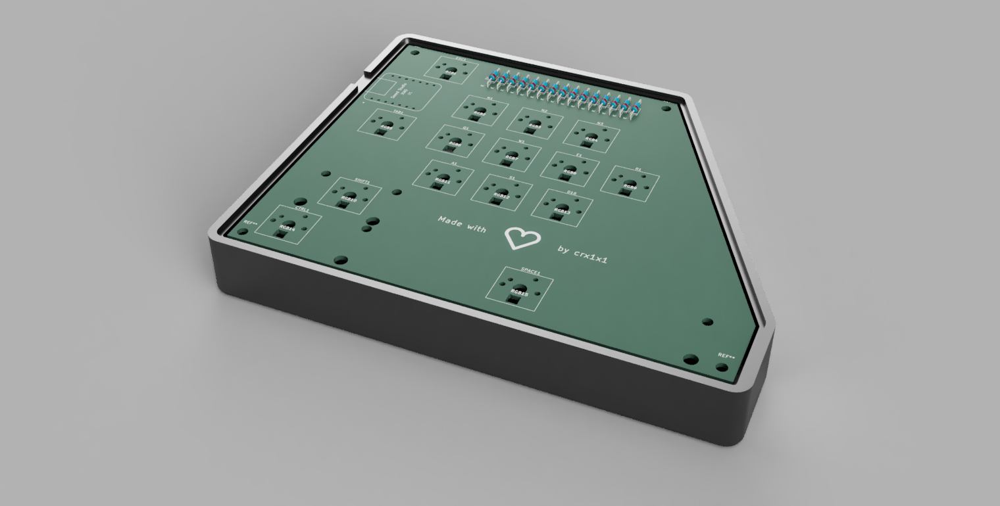
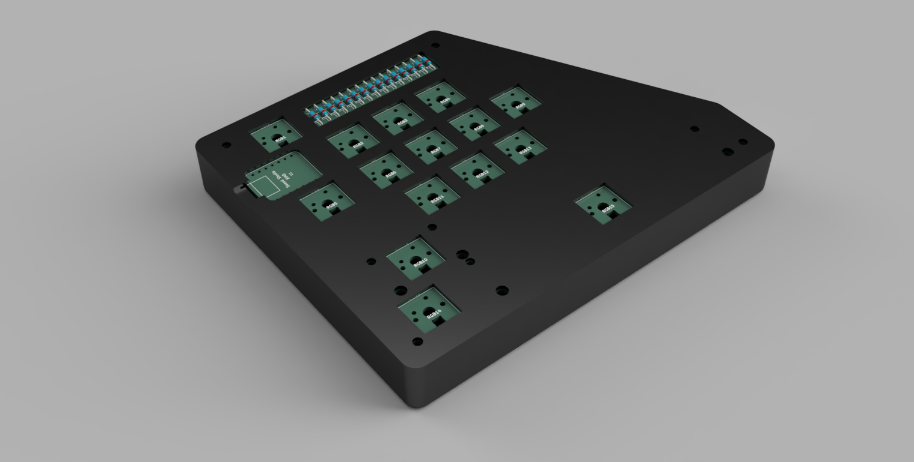
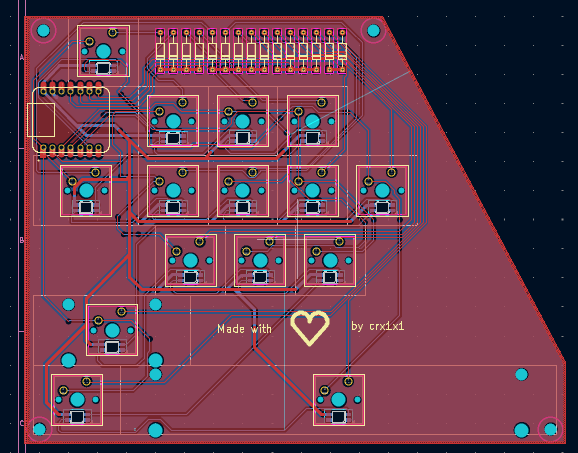
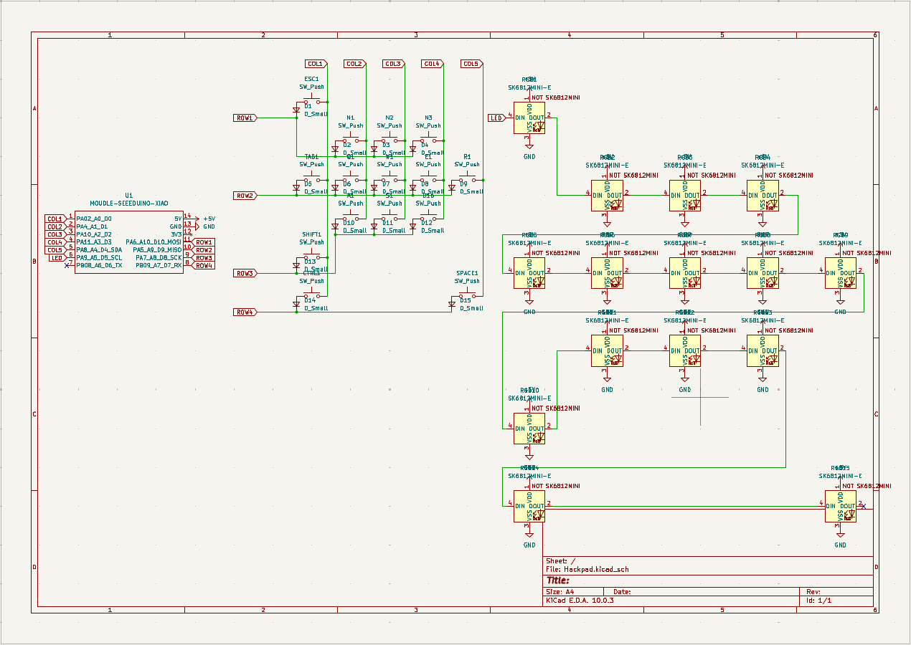

|Reference	|Qty	|Value	|DNP	|Exclude from BOM	|Exclude from Board	|Footprint	|Datasheet
|A1,D16,E1,ESC1,N1-N3,Q1,R1,S1,W1	|11	|SW_Push	|	|	|	|Button_Switch_Keyboard:SW_Cherry_MX_1.00u_PCB	|
|CTRL1	|1	|SW_Push	|	|	|	|Button_Switch_Keyboard:SW_Cherry_MX_1.25u_PCB	|
|D1-D15	|15	|D_Small	|	|	|	|Diode_THT:D_DO-35_SOD27_P10.16mm_Horizontal	|
|RGB1-RGB15	|15	|SK6812MINI-E	|	|	|	|footprints:SK6812MINI-E_fixed	|https://cdn-shop.adafruit.com/product-files/4960/4960_SK6812MINI-E_REV02_EN.pdf
|SHIFT1	|1	|SW_Push	|	|	|	|Button_Switch_Keyboard:SW_Cherry_MX_2.25u_PCB	|
|SPACE1	|1	|SW_Push	|	|	|	|Button_Switch_Keyboard:SW_Cherry_MX_6.25u_PCB	|
|TAB1	|1	|SW_Push	|	|	|	|Button_Switch_Keyboard:SW_Cherry_MX_1.50u_PCB	|
|U1	|1	|MOUDLE-SEEEDUINO-XIAO	|	|	|	|footprints:XIAO-Generic-Hybrid-14P-2.54-21X17.8MM	|

